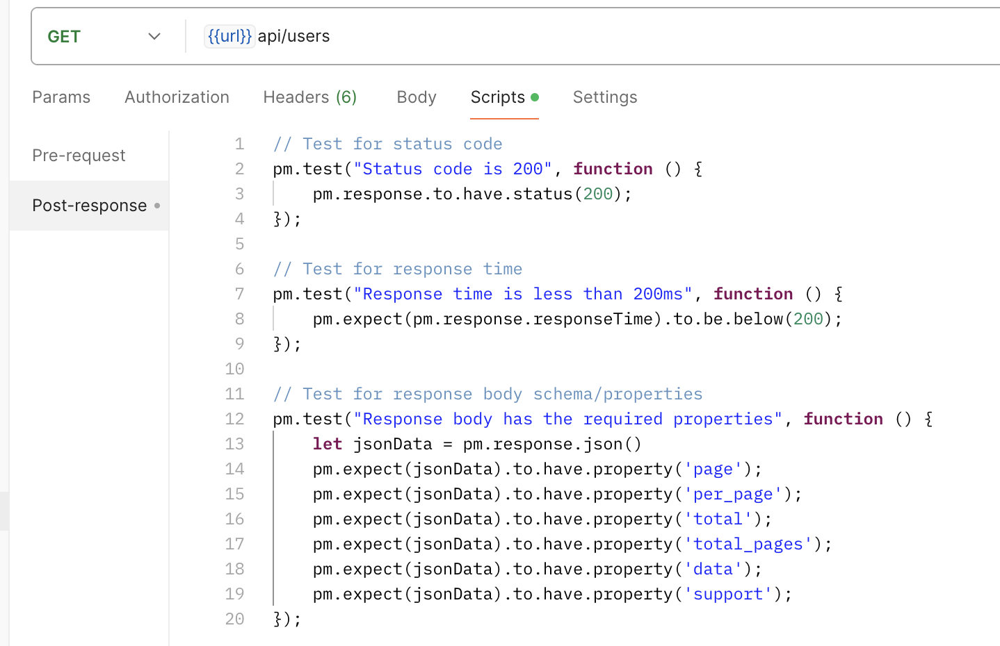
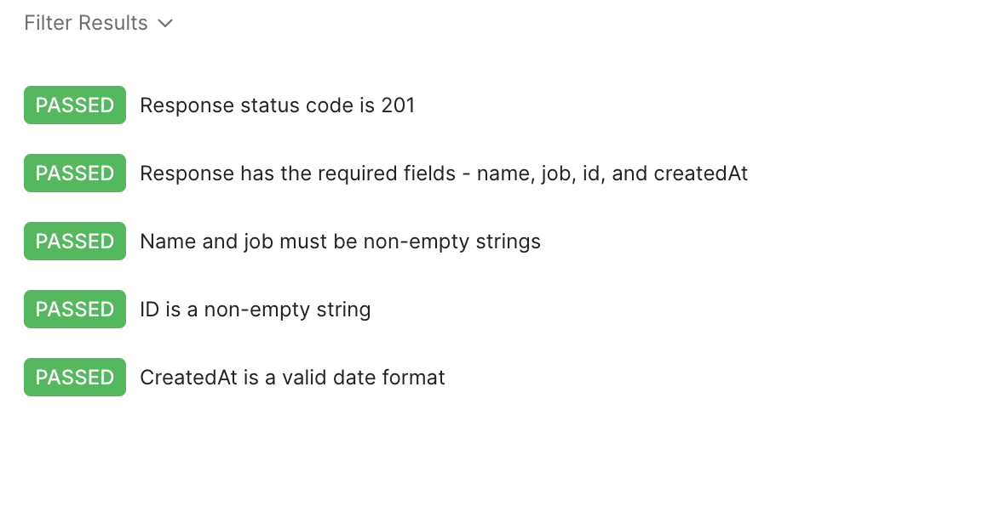
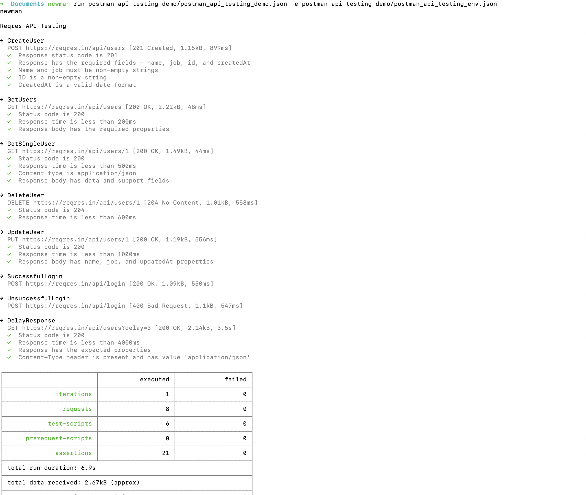
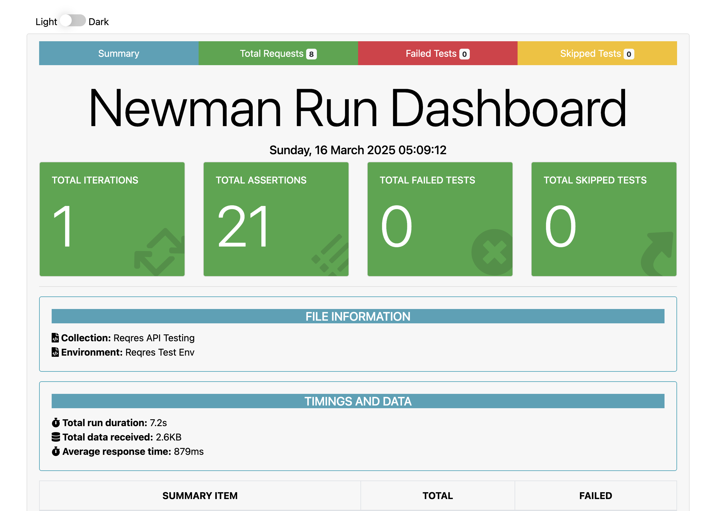

# Postman API Testing Project

This project demonstrates my skills in **API testing** using **Postman**. I tested the **ReqRes API**, a free dummy API, to perform various operations like **GET, POST, PUT, DELETE**, and validated responses using **Postman tests**. I also used **Postman Environments**, **Newman** for command-line execution, and **htmlextra** for generating detailed HTML reports.

---

## **Tools and Technologies Used**
- **Postman**: For API testing and automation.
- **Newman**: For running Postman collections from the command line.
- **htmlextra**: For generating detailed HTML reports.
- **ReqRes API**: A free dummy API for testing CRUD operations.

---

## **Features**
1. **API Testing**:
   - Tested **GET, POST, PUT, DELETE** endpoints.
   - Validated **status codes**, **response time**, and **response data types**.
   - Used **Postman tests** to ensure API responses are correct.

2. **Environment Variables**:
   - Used **Postman Environments** to manage variables like `url` and `token`.

3. **Reports**:
   - Generated **HTML reports** using **htmlextra** for better visualization of test results.

4. **Test Cases**:
   - Validated response time (e.g., response time < 500ms).
   - Checked status codes (e.g., 200 for success, 201 for created, 204 for deleted).
   - Verified response data types (e.g., `name` is a string, `id` is a number).

---

## **How to Set Up and Run the Project**

### **1. Clone the Repository**
```bash
git clone https://github.com/daniyalfarman/Postman-API-Testing-Demo.git
cd postman-api-testing-demo
```

### **2. Install Dependencies**
Install **Newman** and **htmlextra** globally:
```bash
npm install -g newman newman-reporter-htmlextra
```

### **3. Run the Collection**
Run the Postman collection using Newman:
```bash
newman run postman-api-testing-demo/postman_api_testing_demo.json -e postman-api-testing-demo/postman_api_testing_env.json
```
### **4. Create HTML Report**
Run the Postman collection using Newman:
```bash
newman run postman-api-testing-demo/postman_api_testing_demo.json -e postman-api-testing-demo/postman_api_testing_env.json -r htmlextra
```

### **5. View the Report**
After running the tests, an HTML report will be generated in the `newman` folder. Open it in your browser:
```bash
open newman/ `nameofhtmlfile`
```

## **Screenshots**
Here are some screenshots of the project:

### **1. Postman Collection**



### **2. Newman CLI Output**


### **3. HTML Report**


---

## **Conclusion**
This project showcases my ability to:
- Perform **API testing** using Postman.
- Use **Postman Environments** for managing variables.
- Use **Newman** for running tests from command line and generate **HTML reports**.
- Write **comprehensive test cases** to validate API responses.

---

## **Links**
- **GitHub Repository**: [Postman API Testing Project](https://github.com/daniyalfarman/Postman-API-Testing-Demo)
- **ReqRes API Documentation**: [ReqRes API Docs](https://reqres.in/)

---